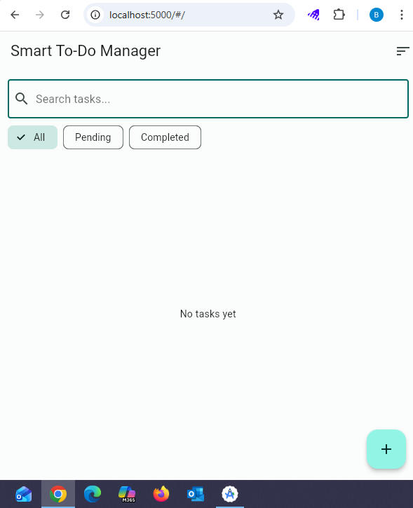
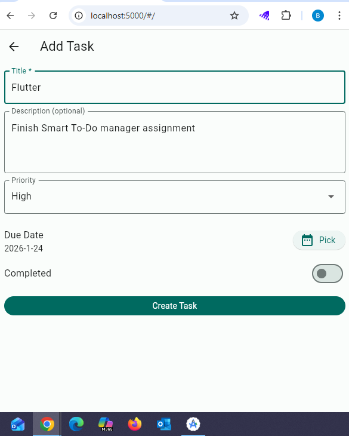
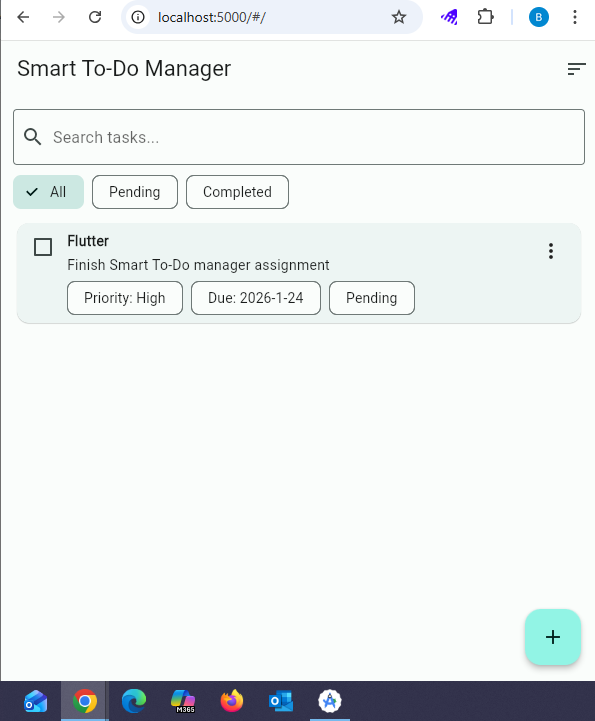
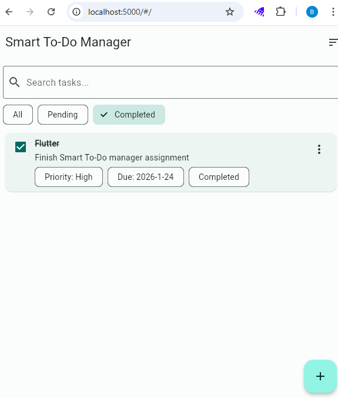
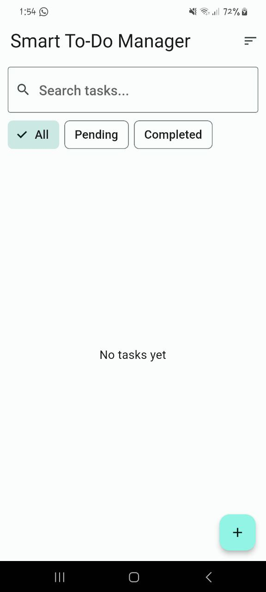
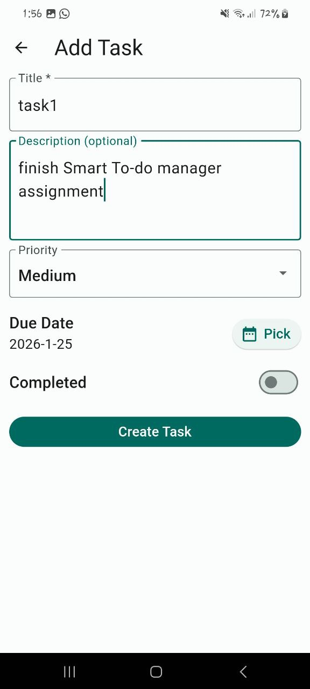
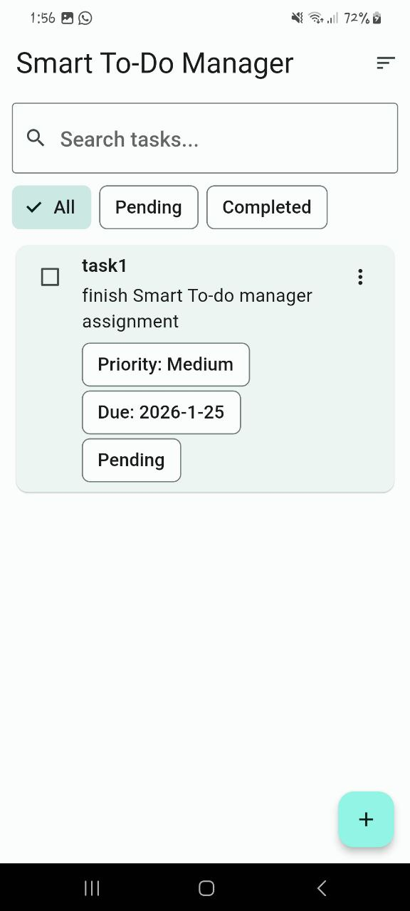
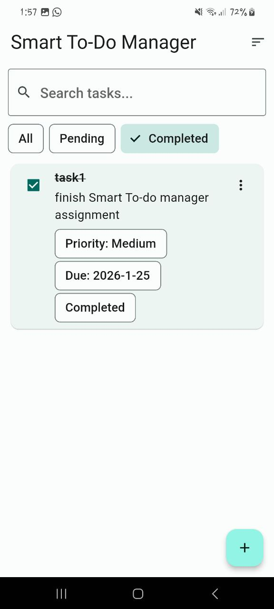
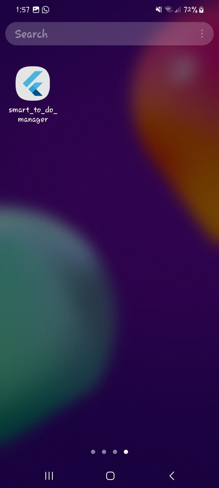

# Smart To-Do Manager

## Project Description
A Flutter task management app that allows the user to:
- Add a new task
- Edit an existing task
- Delete a task
- Mark task as Completed or Pending
- Filter tasks (All / Pending / Completed)
- Search tasks
- Store tasks locally (data persists after restart)

---

## Project Structure (Main Files)

- `lib/main.dart` : App entry point.
- `lib/app.dart` : AppRoot + providers + MaterialApp.
- `lib/data/local/hive_service.dart` : Hive initialization and local storage setup.
- `lib/data/repositories/task_repository.dart` : CRUD operations for tasks (add/edit/delete/update status).
- `lib/models/task.dart` : Task model (Hive object).
- `lib/models/priority.dart` : Priority enum/logic.
- `lib/providers/task_provider.dart` : State management (Provider).
- `lib/ui/screens/home_screen.dart` : Home screen UI.
- `lib/ui/screens/task_form_screen.dart` : Add/Edit task screen UI.
- `lib/ui/widgets/task_tile.dart` : Task item widget.
- `lib/ui/widgets/filters_bar.dart` : Filters (All / Pending / Completed).

---

## Screenshots

### Web Screenshots
**Home**


**Add Task**


**Task List**


**Completed**


---

### Mobile Screenshots (Samsung M62)
**Home**


**Add Task**


**Task List**


**Completed**


**Run on Phone**


---

## How to Run

### Web
```bash
flutter run -d web-server --web-port=5000 --release